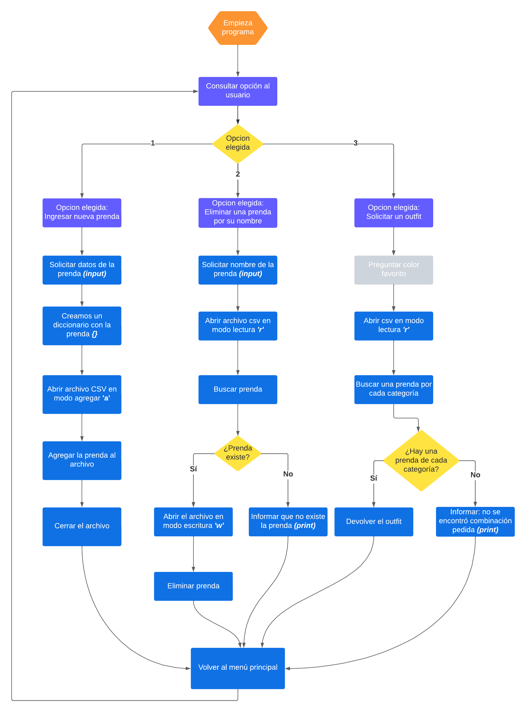

# Enunciado :card_index:

### Tip: Podés leer este archivo formateado usando la combinación de teclas `Ctrl + Shift + V`
#
## Consideraciones al momento de resolver el ejercicio:
1. Todo el ejercicio debe resolverse de forma ordenada, modularizando las diferentes tareas del programa en funciones, **NO** desarrollar todo el programa en el bloque `if __name__ == '__main__'`

2. Para resolver el ejercicio correctamente, **es necesario** que uses las funciones del módulo `herramientas`

## Objetivo del ejercicio
El objetivo de este ejercicio es construir un sistema de guardarropa para un usuario, los requerimientos de nuestra aplicación son los que se detallan a continuación

#

### 1. Formato de la prenda - todas las prendas deben tener los siguientes atributos (`nombre del atributo` : `tipo de dato`)
- `id` : `int`
- `nombre` : `string`
- `categoria` : `string` — Opciones
    - prenda superior
    - prenda inferior
    - accesorio
    - calzado
- `color` : `string`

#

### 2. El sistema debe almacenar los datos en un archivo de tipo CSV, siguiendo la siguiente estructura

```
|----|-----------------|-----------------|------------|
| id | nombre          | categoria       | color      |
|----|-----------------|-----------------|------------|
|  1 | remera vieja    | prenda superior | rojo       |
|----|-----------------|-----------------|------------|
```

*En el ejemplo, solo hay una prenda cargada, con id = 1, nombre = 'remera vieja', categoria = 'prenda superior', color = 'rojo'*

#

### **TIP**: A partir de los dos requerimientos anteriores, podemos ver que una variable que contiene una prenda debe tener la siguiente forma

```json
{"id": 1, "nombre": "remera vieja", "categoria": "prenda superior", "color": "rojo"}
``` 

# 

### 3. El usuario debe poder agregar una prenda a su ropero
Al agregar una nueva prenda al ropero del usuario, esta prenda debe sumarse a su archivo CSV

#

### 4. El usuario debe poder eliminar una prenda de su ropero sabiendo el **nombre** de la prenda
Al eliminar una prenda del ropero, esta prenda debe eliminarse del archivo CSV

#

### 5. El usuario debe poder solicitarle un outfit al sistema
Para poder solicitarle un outfit al sistema, se deben cumplir las siguientes condiciones

- El usuario debe tener por lo menos una prenda superior
- El usuario debe tener por lo menos una prenda inferior
- El usuario debe tener por lo menos un accesorio
- El usuario debe tener por lo menos un calzado

#

### **BONUS**: El usuario debe solicitarle un outfit al sistema indicando un color favorito
Se deben cumplir las mismas condiciones que en el item **6**, pero en este caso, el usuario indica un color, y el sistema
siempre debe elegir la prenda del color indicado por encima de cualquier otro.

Ejemplo:
El usuario eligió **'rojo'**, y tenemos los siguientes accesorios
```json
[
    {"id": 1, "nombre": "gorro", "categoria": "accesorio", "color": "blanco"},
    {"id": 5, "nombre": "guantes", "categoria": "accesorio", "color": "verde"},
    {"id": 10, "nombre": "orejeras", "categoria": "accesorio", "color": "rojo"}
]
```

Al momento de generar el outfit, el sistema deberá seleccionar el accesorio con `"id": 10` (*orejeras*) por encima de los otros accesorios.

# Diagrama de Flujo *(Sugerencia)*
Este diagrama representa sólo **una** posible solución, no significa que sea el único válido

