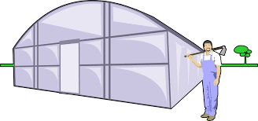

# Proyecto Invernadero -  Alumno: Pablo D. Fiore

Contacto: pablofiore@gmail.com\
Web: [Perfil LinkedIn] https://www.linkedin.com/in/pablo-fiore-22774013

# 🍅Proyecto Final - Curso Python Inicial

Con este ejercicio final, se busca afianzar los siguientes conceptos aprendidos en el curso **Python Inicial**
- Variables
- Control de Flujo — Condicionales y Bucles
- Funciones
- Manejo de Diccionarios
- Manejo de archivos
## Subtitulo 1
### subtitulo 2
**Letra Negrita**

- `Resaltado fondo`
