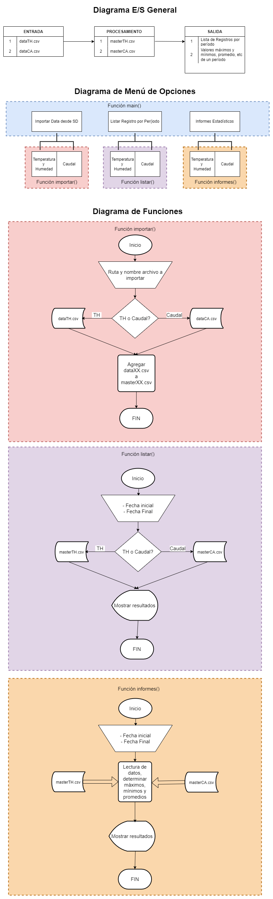

# Proyecto Invernadero -  Alumno: Pablo D. Fiore

Contacto: pablofiore@gmail.com\
Web: [Perfil LinkedIn] https://www.linkedin.com/in/pablo-fiore-22774013

# 🍅Proyecto Final - Curso Python Inicial

Con este ejercicio final, se busca afianzar los siguientes conceptos aprendidos en el curso **Python Inicial**
- Variables
- Control de Flujo — Condicionales y Bucles
- Funciones
- Manejo de Diccionarios
- Manejo de archivos

## - Descripción del proyecto
### -- Contexto de la idea y selección del problema a resolver.
  Durante la pandemia de Covid-19, tuve un requerimiento por parte de un ingeniero agrónomo de su necesidad de obtener datos de las temperaturas y niveles de humedad
  que se registran dentro de un invernadero de cultivo a su cargo, como también el volumen de agua vertido en el cultivo durante períodos delimitados.
  
  Atendiendo este requerimiento diseñé y construí un dispositivo que mide y registra estos datos mediante tres sensores de temperatura y humedad ambiente, otros tres
  sensores capacitivos de humedad de suelo y un caudalímetro de sensor magnético.
  
  El sistema sensa y procesa los datos desde dos placas Arduino, almacenando registros cada tanto tiempo, de acuerdo a la frecuencia de muestreo requerida. 
  Estos registros son almacenados en dos tarjetas de memoria SD, una para los registros de temperatura y humedad en ambiente y suelo, y en la otra tarjeta SD se 
  almacena volumen de agua y caudal máximo registrado en un lapso de tiempo de riego continuo. Todos estos registros almacenan fecha y hora en que se sensaron los
  valores.
  
**Objetivos**

  Diseñar y construir un programa que permita:

- Importar los datos almacenados en las tarjetas de memoria SD incorporando esa información a dos archivos maestros en el disco duro de la computadora donde esté
  corriendo el programa.

- Visualizar los registros individuales almacenados en dichos archivos maestros.

- Procesar estos registros y generar informes de valores máximos, mínimos y promedios; brindando esa información al operador para la toma de desiciones.

**Estructura y organización de los datos**

Los datos recolectados en el dispositivo se encuentran en dos memorias SD separadas, una contiene el archivo dataTH.csv y la otra contiene el archivo dataCA.csv.
Cada dos semanas se deben quitar de los dispositivos estas tarjetas de memoria, traspasar los registros a una computadora para su análisis y eliminar los archivos de las tarjetas SD para que se generen los nuevos datos. 
Para el archivo dataTH.csv se estima una cantidad aproximada de 1350 registros con la siguiente estructura:

num_registro, 
hora_registro, 
fecha_registro, 
sensor_T01, 
sensor_T02, 
sensor_T03, 
sensor_H01, 
sensor_H02, 
sensor_H03, 
cap_H01, 
cap_H02, 
cap_H03,

## - Diagramas descriptivos del proyecto

